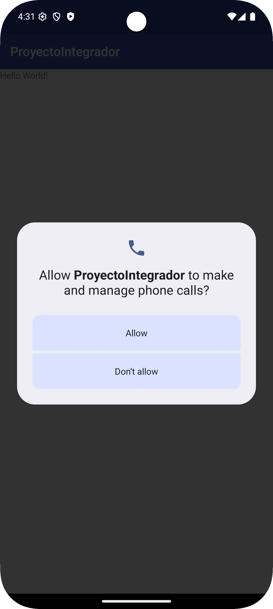
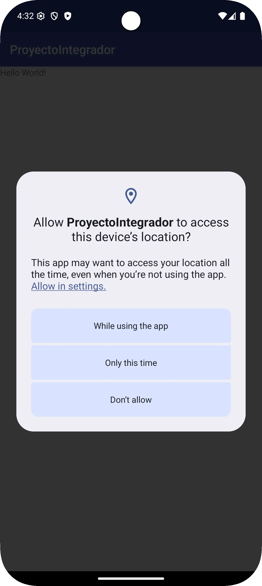
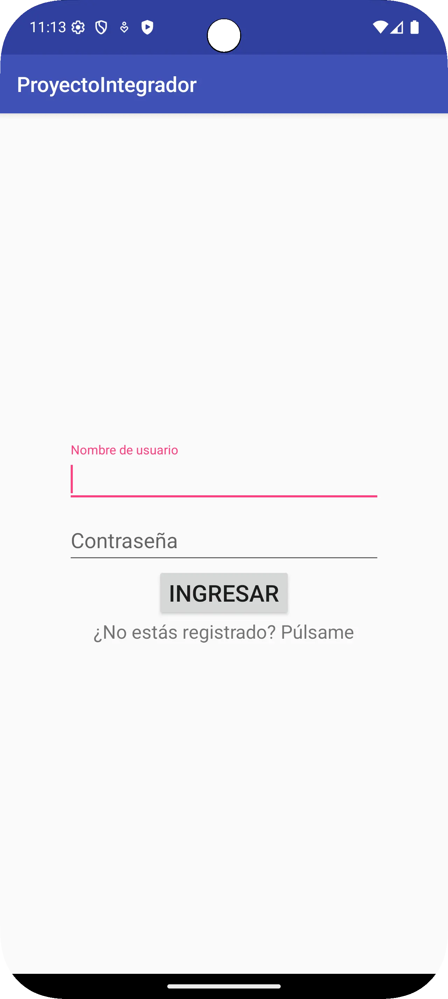
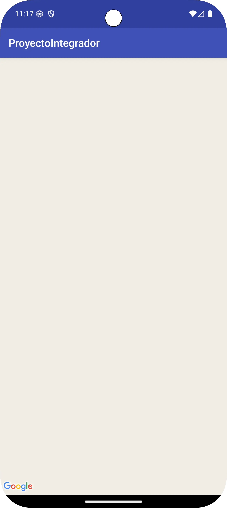

# Proyecto Integrador 2

This is the main repository for the project.

## Description

The purpose of this Android App is to demonstrate all acquired knowledge during Programación Móvil 2 subject.
It includes user authentication (login), a map feature, and a main screen. The project is structured with activities, fragments, and other classes to support its functionality.

## Requirements

- Gradle JDK: 11
- SDK: 27

## Code Structure

The main application code is located in the `/app` module. The core logic is under `/app/src/main/java/com/mcuadrada/proyectointegrador`.

Key components:

*   **Activities**:
    *   `SplashActivity`: The initial screen when the application starts.
    *   `LoginActivity`: Handles user authentication.
    *   `MainActivity`: The main screen after the user logs in.
    *   `MapsActivity`: Displays a map.
*   **Fragments**: The project contains a `Fragments` package, suggesting the use of fragments for the UI.
*   **Patterns**: This package may contain design patterns used in the project.
*   **Classes**: This package likely holds other supporting classes.

## Building the project

This is a standard Gradle project. To build it, you can use the following command from the root of the project:

```bash
./gradlew assembleDebug
```

To run the application, you can open the project in Android Studio and run the `app` configuration.

## Screenshots

|Call permission|Location permission|Login|Sign up|Map view|Close session dialog|
|---|---|---|---|---|---|
|||||||
